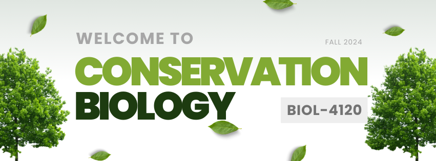
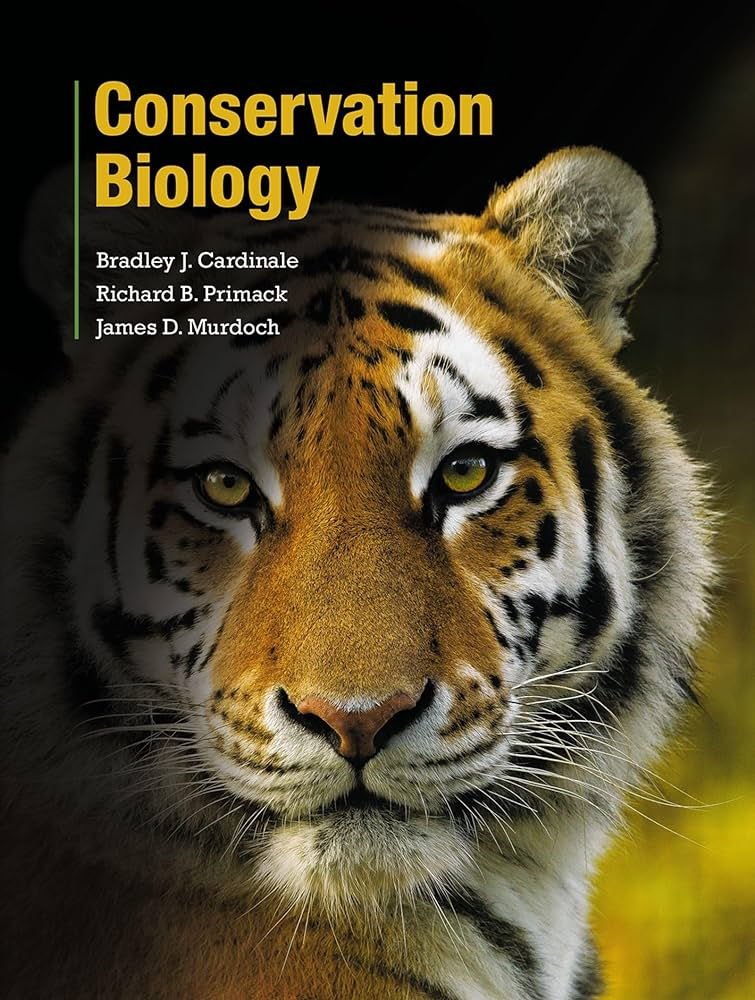
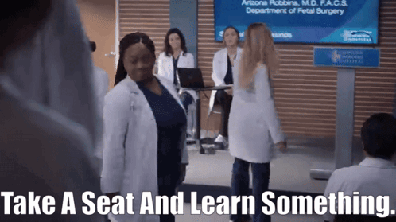
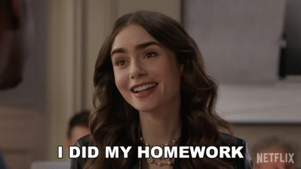
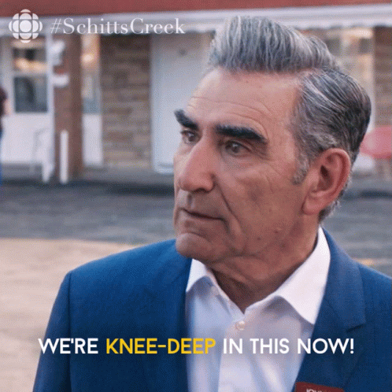
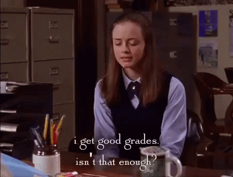

```{r message=FALSE, warning=FALSE, include=FALSE}
source(paste0(params$local, "dependencies/setup.R"))
```


# <span class="hidden-heading">Setup</span>


## <span class="hidden-heading">Constructing Tables</span>

```{r learning-outcomes-tbl, message=FALSE, warning=FALSE, include=FALSE}
learning.outcomes <- tribble(
  ~Theme            ,      ~Outcome           ,
  "Global Patterns" ,    "Produce a synthesis of global patterns of change in biological diversity and ecosystem services and identify issues of particular importance." ,
  "Human Context"   ,    "Evaluate the human context of these changes, including how human activities impact ecosystems and the plants and animals that depend on them and how social, economic, political, and ethical factors determine the possible solutions." ,
  "Science-Based Solutions" , "Analyze how science contributes to solutions for preserving biological diversity."
) %>%
  gt(rowname_col = "Theme") %>%
  cols_label(Outcome ~ "Students will be able to...") %>%
  tab_stubhead(label = "Theme") %>%
  opt_table_lines(extent = "none") %>%
  tab_style(style = list(
                        cell_fill(color    = "#84697FFF"),
                        cell_text(size     = "large",
                                  color    = "#E8EADFFF",
                                  weight   = "bolder",
                                  align    = "left"),
                        cell_borders(sides = c("top", "bottom"))),
            locations = list(cells_column_labels(), cells_stubhead())) %>%
  tab_style(style = list(
                        cell_fill(color    = "#84697F40"),
                        cell_text(
                                  weight   = "bold",
                                  align    = "left")),
            locations = cells_stub()) %>%
  tab_style(style = list(
                        cell_fill(color    = "#84697F40"),
                        cell_text(
                                  align    = "left")),
            locations = cells_body()) %>%
  tab_header(title = "Learning Objectives") %>%
  tab_style(style = list(
                    cell_text(size   = "x-large",
                              align  = "left",
                              weight = "bolder")),
            locations = cells_title()) %>%
  cols_width(stub()        ~ px(300),
             Outcome       ~ px(500))

gtsave(learning.outcomes, paste0(params$local, "dataframes/biol4120_learningoutcomes.html"))
gtsave(learning.outcomes, paste0(params$local, "dataframes/biol4120_learningoutcomes.png" ))
```

```{r grade-breakdown-tbl, message=FALSE, warning=FALSE, include=FALSE}
grade.breakdown <- tribble(
  ~Format                   ,    ~Points_each     ,   ~Count  , ~N_dropped   ,
  "Quizzes"                 ,    3                ,   16      ,  3           ,
  "Exams"                   ,    30               ,   2       ,  0           ,
  "Assignments"             ,    10               ,   3       ,  0           ) %>%
  mutate(Points_total = (Count - N_dropped) * Points_each) %>%
  mutate(Percent_total = Points_total/sum(Points_total)) %>%
  arrange(Percent_total) %>%
  select(Format, Points_each, Count, N_dropped, Points_total, Percent_total) %>%

gt(rowname_col = "Format") %>%
  tab_stubhead(label = "Format") %>%
  cols_label(Points_each   ~ "Points",
             Count         ~ "Count",
             N_dropped     ~ "Drops",
             Points_total  ~ "Total",
             Percent_total ~ "% Total") %>%
  fmt_percent(columns  = Percent_total,
              decimals = 0) %>%
  opt_table_lines(extent = "none") %>%
  tab_style(style = list(cell_borders(color   = "#43475BFF",
                                      sides   = c("top", "bottom"),
                                      style   = "double"),
                         cell_text(stretch = "ultra-condensed",
                                   size    = "small",
                                   weight  = "bold",
                                   style   = "oblique",
                                   align   = "right")),
            locations = list(cells_stubhead(), cells_column_labels())) %>%
  tab_style(style = list(cell_fill(color   = "#E8EADFFF"),
                         cell_borders(sides = "bottom",
                                      color = "#43475BFF",
                                      style = "double"),
                         cell_text(align   = "right",
                                   weight  = "bold",
                                   size    = "large")),
            locations = list(cells_stub(), cells_body(columns = Percent_total))) %>%
  tab_style(style = list(cell_fill(color   = "#E8EADFFF"),
                         cell_borders(sides = "bottom",
                                      color = "#43475BFF",
                                      style = "double"),
                         cell_text(align   = "right",
                                   size    = "large")),
            locations = cells_body(columns = !Percent_total)) %>%
  tab_footnote(md(
"These assignments will focus on quantitative or other specialized skills in Conservation Biology. They will be due at the start of class on the deadline and submitted through Canvas."
), locations = cells_stub(rows = Format == "Assignments")) %>%
  tab_footnote(md(
"These are short quizzes given at the start of class to assess your preparation for the week's topic."
), locations = cells_stub(rows = Format == "Quizzes")) %>%
  tab_footnote(md(
"Number (if any) of lowest scores that will automatically be dropped from your final grade"
), locations = cells_column_labels(columns = N_dropped)) %>%
  tab_footnote(md(
"You will take one Midterm exam and one Final exam. You will be allowed to use hard copy notes/materials for each, but not electronic resources."
), locations = cells_stub(rows = Format == "Exams")) %>%
  tab_style(style     = cell_text(size = "small"),
            locations = cells_footnotes()) %>%
  cols_width(stub()        ~ px(120),
             Points_each   ~ px(85),
             Count         ~ px(85),
             N_dropped     ~ px(85),
             Points_total  ~ px(85),
             Percent_total ~ px(100))
gtsave(grade.breakdown, paste0(params$local, "dataframes/biol4120_gradebreakdown.html"))
gtsave(grade.breakdown, paste0(params$local, "dataframes/biol4120_gradebreakdown.png"))
```


```{r quiz-rubric-tbl, message=FALSE, warning=FALSE, include=FALSE}
quiz.rubric <- tribble(
  ~Score,   ~Standard,
  0     ,   "Nothing submitted." ,
  1     ,   "Response suggests the student is not familiar with any of the background content." ,
  2     ,   "Response suggests the student reviewed some of the material but did not fully comprehend or has not thought critically about it." ,
  3     ,   "Response suggests the student has reviewed the background material and came to class prepared to engage in a thoughtful discussion.") %>%
  gt(rowname_col = "Score") %>%
  opt_table_lines("none") %>%
  tab_header(title = "Quiz Rubric", subtitle = "The assessment system will be broad, so each quiz will only recieve a 0, 1, 2, or 3 as an assessment of the student's basic preparation level for the class.") %>%
  tab_stubhead("Score") %>%
  cols_label(Standard ~ "Standard Met by Response") %>%
  tab_source_note(md("***I will automatically drop every student's lowest 3 scores for these quizzes. So if you do miss 3 quizzes for any reason (e.g., tardiness, absence), your grade will not be penalized.***")) %>%
  tab_style(style = list(cell_fill(color  = "#CBB593FF"),
                         cell_borders(sides = c("top", "bottom")),
                         cell_text(color  = "#43475BFF",
                                   weight = "bold",
                                   size   = "large",
                                   align  = "left",
                                   stretch = "condensed")),
            locations = list(cells_column_labels(), cells_stubhead())) %>%
  tab_style(style = list(
                      cell_fill(color = "#CBB593FF"),
                      cell_borders(sides = c("top", "bottom"),
                                   color = "#43475BFF"),
                      cell_text(color  = "#43475BFF",
                                size = "x-large",
                              align  = "left",
                              weight = "bolder")),
            locations = cells_title(groups = "title")) %>%
  tab_style(style = list(
                    cell_fill(color = "#CBB59340"),
                    cell_text(align = "left",
                              color = "#43475BFF")),
            locations = list(cells_title(groups = "subtitle"), cells_source_notes())) %>%
  tab_style(style = list(cell_fill(color = "#CBB59340"),
                         cell_text(color  = "#43475BFF"),
                         cell_borders(sides = "bottom",
                                      color = "#CBB593FF"),
                         cell_text(align = "left")),
            locations = cells_body()) %>%
  tab_style(style = list(cell_fill(color  = "#CBB59340"),
                         cell_borders(sides = "bottom",
                                      color = "#CBB593FF"),
                         cell_text(color  = "#43475BFF",
                                   align  = "center",
                                   size   = "large",
                                   weight = "bold")),
            locations = cells_stub())
gtsave(quiz.rubric, paste0(params$local, "dataframes/biol4120_quizrubric.html"))
gtsave(quiz.rubric, paste0(params$local, "dataframes/biol4120_quizrubric.png"))
```

```{r class-culture-tbl, message=FALSE, warning=FALSE, include=FALSE}
class.culture <- tribble(
  ~Value           ,  ~Rule                                                                                          , ~Icon         ,
  "1. Authenticity"   , "Speak up if you are confused or struggling."                                                   , "circle-check",
  "1. Authenticity"   , "Attempt to manipulate or mislead your instructors or classmates."                              , "ban"         ,
  "1. Authenticity"   , "Be honest with yourself about your needs & capabilities."                                      , "circle-check",
  "1. Authenticity"   , "Hide or deny your biases or areas for growth."                                                 , "ban"         , 
  "1. Authenticity"   , "Use tools like AI and collaboration with integrity."                                           , "circle-check", 
  "1. Authenticity"   , "Present direct results from AI tools like ChatGPT as your own work."                           , "ban"         ,  
  "1. Authenticity"   , "Take full personal responsibility for mistakes or missed opportunities."                       , "circle-check", 
  "1. Authenticity"   , "Deflect blame or redirect responsibilities on your instructor or your classmates."             , "ban"         ,  
  "2. Curiosity"      , "Use the readings and assignments as a guide."                                                  , "circle-check", 
  "2. Curiosity"      , "Let the syllabus limit your investigation."                                                    , "ban"         , 
  "2. Curiosity"      , "Ask thoughtful questions of yourself, your instructor, and your colleagues."                   , "circle-check", 
  "2. Curiosity"      , "Expect me to fill your brain with facts for you to recall."                                    , "ban"         , 
  "2. Curiosity"      , "Bring your ideas to my attention."                                                             , "circle-check", 
  "2. Curiosity"      ,  "Assume I will not be open to changing or expanding your options."                             , "ban"         , 
  "3. Inclusion"      , "Make space for your colleagues to gain just as much as you."                                   , "circle-check", 
  "3. Inclusion"      , "Dominate discussions."                                                                         , "ban"         , 
  "3. Inclusion"      , "Maintain awareness and openness to seeing your bias and privilege."                            , "circle-check", 
  "3. Inclusion"      , "Assume everyone will share your perspectives or background."                                   , "ban"         , 
  "3. Inclusion"      , "Bring your barriers to my attention so I can help you navigate them."                          , "circle-check", 
  "3. Inclusion"      , "Assume only you are navigating barriers or that barriers are insurmountable with cooperation." , "ban"         ) %>%
  arrange(Value, desc(Icon)) %>%
  
  gt(rowname_col = "Icon", groupname_col = "Value") %>%
  opt_table_lines(extent = "none") %>%
  tab_header(title = "Classroom Culture", subtitle = "The following three values form the foundation of my classroom culture and expectations:") %>%
  
  tab_style(style     = list(cell_text(size   = "x-large",
                                       align  = "left",
                                       weight = "bold",
                                       v_align = "bottom")),
            locations = cells_title(groups    = "title")) %>%
  tab_style(style     = list(cell_text(style   = "italic",
                                       align   = "left",
                                       v_align = "bottom")),
            locations = cells_title(groups    = "subtitle")) %>%
  
  tab_style(style     = list(
                        cell_fill(color    = "#C48329FF"),
                        cell_borders(sides = "top",
                                     color = "black",
                                     weight = px(3),
                                     style = "double"),
                        cell_text(weight    = "bold",
                                  color     = "white",
                                  transform = "uppercase",
                                  size      = "large",
                                  stretch   = "expanded",
                                  style     = "oblique")),
            locations = cells_row_groups()) %>%
  
  tab_style(style = cell_fill(color = "#514A2E40"),
            locations = cells_body(rows = Icon == "circle-check")) %>%
  
  tab_style(style = cell_fill(color = "#8E411540"),
            locations = cells_body(rows = Icon == "ban")) %>%
  
  tab_style(style     = list(cell_text(weight   = "bold"),
                             cell_borders(sides = "bottom")),
            locations = cells_column_labels()) %>%
  
  cols_align(align = "left") %>%
  
  fmt_icon(columns = stub(),
           rows         = Icon == "circle-check",
           height       = "1em",
           fill_color   = "#514A2EFF") %>%
  fmt_icon(columns = stub(),
           rows         = Icon == "ban",
           height       = "1em",
           fill_color   = "#8E4115FF") %>%
  
  tab_style(style = list(cell_fill(color = "#514A2E40"),
                         cell_text(weight = "bolder")),
            locations = cells_stub(rows = Icon == "circle-check")) %>%
  
  tab_style(style = list(cell_fill(color = "#8E411540"),
                         cell_text(weight = "bolder")),
            locations = cells_stub(rows = Icon == "ban")) %>%
  cols_label(Rule  ~ "")

gtsave(class.culture, paste0(params$local, "dataframes/classculture.html"))
gtsave(class.culture, paste0(params$local, "dataframes/classculture.png"))
```

```{r resources-tbl, message=FALSE, warning=FALSE, include=FALSE}
resources <- tribble(
  ~Name    ,   ~Link      ,                                                                        ~Comment  ,
  "Textbook", "https://unomaha.instructure.com/courses/81170/external_tools/1766?display=borderless",  "Conservation Biology - eBook you will access through Canvas",
  "Canvas" , "https://unomaha.instructure.com/courses/81170"                               ,  "You must review Canvas regularly. For technical support, please use Canvas Student Support.",
  "Waterbear", "https://www.waterbear.com/" , "Waterbear is a free streaming service with Environmental and Sustainability documentaries. We may watch some videos here during class, or I may assign others." ,
  "Canva"  ,  "https://www.canva.com/"   , "Sometimes I incorporate Canva collaboration tools in the classroom."
) %>%
  mutate(Resource = str_glue(fixed("["), "{Name}", fixed("]("), "{Link}", fixed(")"))) %>%
  mutate(image = case_when(Name == "Textbook"  ~ "conbiotext_cover.jpg",
                           Name == "Canvas"    ~ "logo_canvas.png",
                           Name == "Waterbear" ~ "logo_waterbear.jpg",
                           Name == "Canva"     ~ "logo_canva.png")) %>%
  select(image, Resource, Comment, Name)

necessary.resources <- resources %>%
gt(rowname_col = "image") %>%
  cols_label(Comment ~ "How to access or get help...",
             Resource ~ "Resources") %>%
  fmt_markdown(columns = "Resource") %>%
  fmt_image(columns = stub()) %>%
  opt_table_lines(extent = "none") %>%
  tab_style(style = list(
                        cell_fill(color    = "#E8EADFFF"),
                        cell_text(size     = "large",
                                  color    = "#43475BFF",
                                  weight   = "bold",
                                  align    = "left",
                                  stretch  = "condensed"),
                        cell_borders(sides = c("top", "bottom"))),
            locations = cells_column_labels()) %>%
  tab_style(style = list(
                        cell_fill(color    = "#E8EADFFF"),
                        cell_text(size     = "large",
                                  color    = "#43475BFF",
                                  weight   = "bold",
                                  align    = "left"),
                        cell_borders(sides = c("top", "bottom"))),
            locations = cells_stubhead()) %>%
  
  tab_style(style = list(
                        cell_fill(color    = "#E8EADF40"),
                        cell_text(v_align = "middle")),
            locations = list(cells_body(), cells_stub())) %>%
  
  cols_align(align = "right",   columns = stub()) %>%
  cols_align(align = "left",   columns = Resource) %>%
  
  tab_header(title = "Summary of Required Course Materials") %>%
  
  tab_style(style = list(
                    cell_text(size   = "x-large",
                              align  = "left",
                              weight = "bolder")),
            locations = cells_title()) %>%
  
  tab_footnote(md("The course’s required electronic textbook will be delivered through UNO’s First Day Access Program, which allows you to access the materials directly through Canvas on the first day of class. **You do not need to purchase any materials prior to starting class.** The cost of the electronic textbook will be billed to your student account approximately 2 weeks after the start of classes. You will have the option to opt out of the First Day Access Program and purchase the electronic text elsewhere, but doing so will likely result in a greater cost."),
               locations = cells_body(columns = Comment, rows = Name == "Textbook")) %>%
  
  tab_footnote(md(
  "There is live chat-based support for students [available online](https://cases.canvaslms.com/liveagentchat?chattype=student&sfid=Wu2Pmk3GRxnkttxWmk98UaS5AZZmI4nk4U8x7cCG), or you may call the hotline +1-844-691-2290 instead."), 
  locations = cells_body(columns = Comment, rows = Name == "Canvas")) %>%
  
  tab_footnote(md(
  "You can create a free account now, and if you use your university affiliation, you can request a free premium subscription."), 
               locations = cells_body(columns = Comment, rows = Name == "Canva")) %>%
  
  tab_footnote(md("Create a free account with your email to access."), 
               locations = cells_body(columns = Comment, rows = Name == "Waterbear")) %>%
  cols_hide(columns = Name) %>%
  cols_width(stub()   ~ px(50),
             Resource ~ px(100),
             Comment  ~ px(700))
```


```{r schedule-tbl, message=FALSE, warning=FALSE, include=FALSE}
holidays <- c(
              ymd_hm(paste("2024-09-02", params$time), tz = "America/Chicago"),
              ymd_hm(paste("2024-10-21", params$time), tz = "America/Chicago"),
              ymd_hm(paste("2024-10-22", params$time), tz = "America/Chicago"),
              ymd_hm(paste("2024-11-26", params$time), tz = "America/Chicago"),
              ymd_hm(paste("2024-11-27", params$time), tz = "America/Chicago"),
              ymd_hm(paste("2024-11-28", params$time), tz = "America/Chicago"),
              ymd_hm(paste("2024-11-29", params$time), tz = "America/Chicago"))

nweeks       <- as.numeric(interval(params$semstart, params$finals), unit = "days")/7
course_start <-        ymd_hm(paste(params$semstart, params$time), tz = "America/Chicago")

schedule_df <- expand.grid(
  Week             = 1:nweeks,
  Date             = params$daysweek,
  stringsAsFactors = FALSE
) %>%
  mutate(
    Date        = course_start + weeks(Week - 1) + days(Date)
  ) %>%
  arrange(Date) %>%
  group_by(Week) %>%
  mutate(day_week = row_number()) %>%
  ungroup()


schedule <- read.recent.version.csv("data", "ScheduleConBioF24_") %>%
  left_join(schedule_df) %>%
   mutate(row_shade = case_when(Week == 1  ~ "#EBDDC34D",
                                Week == 2  ~ "#775F554D",
                                Week == 3  ~ "#94B6D24D",
                                Week == 4  ~ "#DD80474D",
                                Week == 5  ~ "#A5AB814D",
                                Week == 6  ~ "#D8B25C4D",
                                Week == 7  ~ "#7BA79D4D",
                                Week == 8  ~ "#968C8C4D",
                                Week == 9  ~ "#EBDDC34D",
                                Week == 10 ~ "#775F554D",
                                Week == 11 ~ "#94B6D24D",
                                Week == 12 ~ "#DD80474D",
                                Week == 13 ~ "#A5AB814D",
                                Week == 14 ~ "#D8B25C4D",
                                Week == 15 ~ "#7BA79D4D",
                                Week == 16 ~ "#968C8C4D")) %>%
  mutate(row_shade  = if_else(str_detect(Topic, ".+Exam.+"), "black", row_shade)) %>%
  mutate(Topic = ifelse(Date %in% holidays, "No Class", Topic)) %>%
  ungroup() %>%
  arrange(Date) %>%
  mutate(AssignedPages = ReadEnd - ReadStart,
         LecturePages  = PlanEnd - PlanStart) %>%
  mutate(Due = if_else(
           is.na(ReadCh), "",
           str_glue("Read Ch ", "{ReadCh}", " - pgs ", "{ReadStart}", "-", "{ReadEnd}", fixed(" <em>("), "{AssignedPages}", fixed(" pp)</em>")))) %>%
  mutate(Due = case_when(
            is.na(SkillsAssignment) ~ Due,
           !is.na(SkillsAssignment) & Due == "" ~ str_glue("Submit Skills Assignment ", "{SkillsAssignment}"),
           !is.na(SkillsAssignment) & Due != "" ~ str_glue("{Due}", "<br>& ", "Submit Skills Assignment ", "{SkillsAssignment}"))) %>%
  mutate(Prep_icon = case_when(
    Due    == ""                               ~ "",
     is.na(ReadCh)  & !is.na(SkillsAssignment) ~ "pencil",
    !is.na(ReadCh)  & !is.na(SkillsAssignment) ~ "book,pencil",
    !is.na(ReadCh)  &  is.na(SkillsAssignment) ~ "book"),
    Week          = if_else(
    Week          != lag(Week) | row_number() == 1, as.character(Week), ""),
    Date          = as_date(Date)) %>%
  select(Week           ,
         Theme          ,
         Date           ,
         Topic          ,
         Prep_icon      ,
         Due            ,
         row_shade   )

schedule_gt <- schedule %>% 
  
  gt(groupname_col = "Theme") %>%
  
                   rows_add(Date          = as_date("2024-12-19"),
                            Week          = "",
                            Topic         = "5:00 PM - Final Exam",
                            row_shade     = "black",
                            Prep_icon     = "",
                            Due           = "")  %>%
                  
                   fmt_markdown(columns   = Due) %>%
  
  tab_footnote(md("Details will be available through Canvas Assignments. You will also submit your assignment by 4:00 PM on the deadline through Canvas Assignments."), locations = cells_body(columns = Due,
                                       rows    = Prep_icon == "pencil" | Prep_icon == "book,pencil")) %>%
  
                   fmt_icon(columns       = Prep_icon,
                            rows          = Prep_icon != "",
                            sep           = "  ",
                            height        = "1.2em")  %>%
  
                   fmt_date(columns       = Date,
                            date_style    = "MMMEd") %>%

                  cols_label(Prep_icon ~ "Due",
                             Due       ~ "",
                             Week      ~ "Wk") %>%
                  cols_move_to_start(columns = c("Week", "Date", "Topic", "Prep_icon")) %>%
                  opt_table_lines(extent = "none") %>%
                  tab_style(style = list(
                                      cell_fill(color = from_column("row_shade")),
                                      cell_text(size      = "small",
                                                weight    = "bold",
                                                align     = "left",
                                                v_align   = "top",
                                                transform = "uppercase")),
                            locations = cells_body(columns = Week)) %>%
                      tab_style(style = list(
                                      cell_fill(color       = from_column("row_shade")),
                                      cell_text(v_align     = "top",
                                                align       = "left")),
                             locations = cells_body(columns = c("Topic", "Prep_icon", "Due"),
                                                     rows = row_shade != "black")) %>%
                      tab_style(style = list(
                                      cell_fill(color       = from_column("row_shade")),
                                      cell_text(v_align     = "top",
                                                align       = "left",
                                                color       = "white")),
                             locations = cells_body(columns = c("Topic", "Prep_icon", "Due"),
                                                     rows = row_shade == "black")) %>%
  
                      tab_style(style = list(
                                      cell_fill(color        = from_column("row_shade")),
                                      cell_text(stretch      = "condensed",
                                                size         = "small",
                                                transform    = "uppercase",
                                                weight       = "bolder",
                                                align        = "left",
                                                v_align      = "top")),
                              locations = cells_body(columns = Date,
                                                     rows = row_shade != "black")) %>%
  
                    tab_style(style = list(
                                      cell_fill(color     = from_column("row_shade")),
                                      cell_borders(sides  = c("top", "bottom")),
                                      cell_text(weight    = "bolder",
                                                size      = "small",
                                                align     = "left",
                                                v_align   = "top",
                                                style     = "oblique",
                                                transform = "uppercase",
                                                color     = "white")),
                              locations = cells_body(rows = row_shade == "black")) %>%       
                    tab_style(style = list(
                                          cell_text(style     = "oblique",
                                                    transform = "uppercase",
                                                    align     = "left",
                                                    size      = "small",
                                                    weight    = "bolder")),
                              locations = cells_column_labels()) %>%
  
                   cols_align(align = "center", columns = Prep_icon) %>%
                   
                   tab_header(title    = "Course Schedule",
                              subtitle = md("*Subject to change at any time*")) %>%
                   tab_style(style = cell_text(
                                       align   = "left",
                                       weight  = "bolder",
                                       size    = "xx-large"),
                             locations = cells_title(groups = "title")) %>%
                   tab_style(style = list(
                                  cell_borders(sides = "bottom"),
                                  cell_text(
                                       align   = "left",
                                       stretch = "ultra-expanded")),
                             locations = cells_title(groups = "subtitle")) %>%
  
                  tab_style(style = list(
                                      cell_fill(color = "#775F55FF"),
                                      cell_borders(sides  = "top"),
                                      cell_text(stretch   = "ultra-expanded",
                                                color     = "white",
                                                size      = "small",
                                                indent    = px(8),
                                                style     = "oblique",
                                                weight    = "bolder",
                                                transform = "uppercase",
                                                align     = "left")),
                             locations = cells_row_groups(groups = contains("Foundations"))) %>%
                  tab_style(style = list(
                                      cell_fill(color = "#94B6D2FF"),
                                      cell_borders(sides  = "top"),
                                      cell_text(stretch   = "ultra-expanded",
                                                color     = "white",
                                                size      = "small",
                                                indent    = px(8),
                                                style     = "oblique",
                                                weight    = "bolder",
                                                transform = "uppercase",
                                                align     = "left")),
                             locations = cells_row_groups(groups = contains("Importance"))) %>%
                  tab_style(style = list(
                                      cell_fill(color = "#DD8047FF"),
                                      cell_borders(sides  = "top"),
                                      cell_text(stretch   = "ultra-expanded",
                                                color     = "white",
                                                size      = "small",
                                                indent    = px(8),
                                                style     = "oblique",
                                                weight    = "bolder",
                                                transform = "uppercase",
                                                align     = "left")),
                             locations = cells_row_groups(groups = contains("Threats"))) %>%
                  tab_style(style = list(
                                      cell_fill(color = "#A5AB81FF"),
                                      cell_borders(sides  = "top"),
                                      cell_text(stretch   = "ultra-expanded",
                                                color     = "white",
                                                size      = "small",
                                                indent    = px(8),
                                                style     = "oblique",
                                                weight    = "bolder",
                                                transform = "uppercase",
                                                align     = "left")),
                             locations = cells_row_groups(groups = contains("Approaches"))) %>%

                   cols_hide(columns = c("row_shade")) %>%
                   cols_width(Week      ~ px(40),
                              Date      ~ px(110),
                              Topic     ~ px(350),
                              Prep_icon ~ px(75),
                              Due       ~ px(300)) %>%
                   
                   tab_header(title    = "Course Schedule",
                              subtitle = paste0("Subject to change - last updated on ", today())) %>%
                   tab_style(style = cell_text(
                                       align   = "left",
                                       weight  = "bolder",
                                       size    = "xx-large"),
                             locations = cells_title(groups = "title")) %>%
                   tab_style(style = list(
                                  cell_borders(sides = "bottom"),
                                  cell_text(
                                       align   = "left",
                                       style   = "italic")),
                             locations = cells_title(groups = "subtitle")) %>%
                   tab_footnote(md("You are responsible for in-class announcements and/or updates made on Canvas. Please keep your records organized."),
                                locations = cells_title(groups = "subtitle")) %>%
                   tab_footnote("You should come to class having already read that day's assigned pages.",
                                locations = cells_column_labels(columns = Prep_icon)) %>%
                   tab_footnote(
    "You will take the exam in class and will be able to access hard-copy materials (i.e., hand-written or printed notes) but nothing electronic.",
                                locations = cells_body(columns = "Topic",
                                                       rows    = row_shade == "black"))

gtsave(schedule_gt, paste0(params$local, "schedules/biol4120_schedule_F24.html"))
gtsave(schedule_gt, paste0(params$local, "schedules/biol4120_schedule_F24.png"))

```

# General Information

<div class="box-container">
<div class="box-header-s">This Course Meets:</div>
<div class="info-box-s">
  <p>Weekly, on Mondays and Wednesdays</p>
  <p>From 4:00 - 5:15 PM in Allwine Hall, Room 304</p></div>
<div class="box-header-s">Prerequisites</div>
<div class="info-box-s">
  <p>BIOL 1450, 1750, 2140 and Junior-Senior in biology. Not open to non-degree graduate students.</p></div>
<div class="box-header-s">Course Description</div>
<div class="info-box-s">
  <p>Study of biological diversity at the genetic, species, and ecosystem levels, its values, and the factors that threaten it. We will explore the scientific basis of conservation biology and how it can be applied to maintain biological diversity.  (Cross-listed with BIOL 8126).</p></div>
<div class="box-header-s">Course Website</div>
<div class="info-box-s">
  <p>You will participate in this course using the UNO Canvas learning management platform. Once on the platform, you can learn how to use Canvas effectively by clicking the “Help” link on the top right of the course page on Canvas.</p></div>
 </div>
 
<div class="float-container">
<div class="box-header-p">Course Textbook</div>
<div class="float-box-p">
  
  <p><strong>Conservation Biology by Cardinale, Primack & Murdoch</strong></p>
  <p>You will need to have your own copy of this textbook for class this semester. While the text is available in hard copy, I recommend you opt-in for the ebook option through Canvas. The ebook option gives you access to additional links and resources that you will find helpful for studying.</p>
  <p>To opt-in, log into our course Canvas page and navigate to the <em>IA Bookshelf</em> page (found just below <em>Modules</em>). Once you opt-in, you will automatically recieve a charge through your university Bursar account. That means the cost will automatically add to your tuition and other fees for the semester, and any financial aid you recieve will also apply.</p>
</div>
</div>


## Instructor

<div class="float-container">
<div class="box-header-p">Alicia M. Rich, Ph.D., Assistant Professor of Biology</div>
<div class="float-box-p">
 
 <p><strong>Please call me:</strong> Dr. Rich or Professor Rich (she/her)</p>
 <p><strong>Contact:</strong> <a href="mailto:aliciarich@unomaha.edu" class="email">aliciarich@unomaha.edu</a></p>
 <p><strong>Office:</strong> Allwine Hall Room 413</p>
 <p><strong>Office Hours:</strong> By appointment on W/R from 10-12</p>
 <p><em>Please do not use Canvas messages to contact me. I will not monitor those.</em></p>
 <p>I will return your emails within 48 business hours, but I may not check my email during evenings or weekends. If you are still waiting for a response after three business days, please reach out again.</p>
 <p>If you would like to schedule an in-person meeting, please request this at least 48 hours in advance. I do not schedule student meetings outside regular workday hours <em>(M-F, 9-5)</em>, so please do not ask me to meet with you in the evenings or on weekends.</p>
  <p><strong>Ask me about:</strong> Primates, Field Research, Zoos, Molecular Biology, Social Justice, Anthropology, Trail Running, Swimming</p>
</div>  
</div>

# Detailed Information

<div class="gif-container">
</img>
<div class="flex-item">
```{r echo=FALSE, message=FALSE, warning=FALSE, paged.print=FALSE, results="asis"}
learning.outcomes
```
</div>
</div>

## Course Materials

</img>

```{r echo=FALSE, message=FALSE, warning=FALSE, paged.print=FALSE, results="asis"}
schedule_gt
```

## Assignments

<div class="gif-container">
<div class="gif-textcontainer">
>All assignments are listed in the course schedule (above). Most will be assigned reading from the textbook, but you will also complete a series of three different Quantitative Skills Assignments over the course of the semester. The assignment and details are linked in your textbook, but I will also provide pdf copies on Canvas.

</div>
</img>
</div>

<div class="box-container">
<div class="box-header-s">Explanation of Quantitative Skills Assignments</div>
<div class="box-subheader-s">Conservation Biology is an applied discipline that depends on a vast array of constantly evolving quantitative and computational tools.</div>
<div class="info-box-s">You will gain a surface-level understanding of just a few of these approaches by completing three different Quantitative Skills Assignments over the course of the semester. The assignments are linked in your textbook, but I will also provide the pdf versions on Canvas inside the Assignment page for each.</div>
<div class="box-subheader-s">Each exercise walks you through a spreadsheet-based analysis, which means you will need to have some basic familiarity with Microsoft Excel or Google Sheets.</div>
<div class="info-box-s">If you could use a primer on this, I recommend following the Intro to Spreadsheets pdf file that will also be on Canvas. If you don't already have Microsoft Excel on your computer, remember that you can access a free standalone or browser version through your UNO login. For extra information, [visit the University of Nebraska IT website](https://nusupport.nebraska.edu/TDClient/33/Portal/Requests/ServiceDet?ID=45). You can also use Google Sheets as a free alternative.</div>
<div class="box-subheader-s">The deadline for each Skills Assignment is listed in the schedule above You will submit these on Canvas by 4:00 PM on the day they are due. You are welcome to work together on these assignments as much as you find helpful, so long as you each submit your own version and feel prepared to replicate that work if asked to on an exam.</div>
</div>

</img>


## Readings

All assigned readings will come from our textbook, and they are listed in the schedule below. We will use our class time to work together on some of the most important or challenging concepts, but this will not be a substitute for reading and studying the material on your own. Our class time for most chapters will span multiple days, but you should come to class having independently reviewed the material from that chapter on the day we begin covering it. We will skip material from some of the chapters, or skip some chapters all together, so you should follow the assigned page numbers listed in the schedule.

<div class="info-box-o">
You should be prepared to answer quiz questions on anything from the assigned readings starting on the deadline listed in the schedule.
</div>


# Expectations & Assessment

## Attendance

<div class="box-container">
<div class="box-header-o">This is not an online or hybrid course.</div>
<div class="info-box-o">I designed the curriculum and objectives specifically with that in mind, so to succeed you must attend and engage with every scheduled meeting. <strong>You will not pass this class if you are unable to attend and take your own notes.</strong></div>
</div>

Absences may only be truly <em>excused</em> if they have been registered through the Accessibility Services Center. Please do not provide me with any personal or medical details to explain your barriers to attendance or assignment completion. While I do care about accommodating these issues when they arise, I also care about your privacy and respect that office's expertise in managing the conditions and complications that are outside of my purview. I do my best to integrate a reasonable and universal degree of flexibility into our schedule and assessment plan to accommodate some work/life balance while also ensuring equity and reasonable progress in your learning. I am happy to recieve requests and recommendations to help me update and improve this approach for everyone, but I will only create personalized accommodations by working directly with the ASC.  

<div class="info-box-p">
Please also know that I genuinely appreciate opportunities to work with and around student barriers by collaborating with the ASC. If you know that you are coming into the semester with learning barriers (e.g., neurodivergence, visual/auditory processing differences), I strongly encourage you to register this with their office and then communicate with me about the ways I can work this into my approach from the beginning. </div>

### How to Earn that Grade
<div class="gif-container">
<div class="gif-item"></div>
<div class="table-gif">
```{r  echo=FALSE, message=FALSE, warning=FALSE, paged.print=FALSE, results="asis"}
grade.breakdown
```
</div>
</div>

### Preparation Quizzes 
<div class="box-container">
<div class="box-header-b">Many of our class meetings will begin with a short assessment of your preparation for that week's materials.</div>
<div class="info-box-b"><p>These quizzes will only serve as an incentive to ensure widespread accountability for engaging with our discussions and keeping up with the assigned background material. I will ask 1-2 questions that require you to provide a surface-level reflection on some component of the assigned material in no more than 1-3 sentences.</p>
<p>Please arrive to each class on time, having completed the assigned background material for that week and brought a writing utencil. If you arrrive after a quiz is over, I will not interrupt the class to give you the quiz, and I will not let you take the quiz after recieving additional information that the others did not access before taking theirs.</p>
<div class="flex-item">
```{r echo=FALSE, message=FALSE, warning=FALSE, paged.print=FALSE, results="asis"}
quiz.rubric  
```
</div>
</div>

### Late Assignments
<div class="box-container">
<div class="box-header-o">While I prefer to implement as flexible a deadline policy as possible, I also have to maintain reasonable processing times for assessing every student's submissions and submitting grades.</div> 
<div class="info-box-o">
<p>To incentivize timely submissions, I will deduct <strong>10% from the final grade on any assignment submitted after the deadline.</strong> I will not accept any work from the first half of the semester submitted after our Midterm Exam, and I will not accept any work from the second half of the semester submitted after 5:00 PM on the last Friday of classes (i.e., the Friday before final exams begin). Unless Accessibility Services reaches out to discuss extremely extenuating circumstances with me, I will not make any exceptions to grade your work after the Final Exam.</p>
<p>If you have arranged formal accommodation requests through Accessibility Services for your assignment deadlines (see Section on University Policies below), then I will be happy to honor those to my full ability. <em>Please do not hesitate to remind me if that is the case and I inadvertently apply any late penalties to a grade.</em></p>
</div>
</div>

### Additional Expectations

<div class="gif-container">
</img>
<div class="flex-item">
```{r  echo=FALSE, message=FALSE, warning=FALSE, paged.print=FALSE, results="asis"}
class.culture
```
</div>

### Engagement

<div class="box-container">
<div class="box-superheader-o"> You will only succeed in this class if you take full responsibility for your processing and retention of the content. </div>
<div class="box-subheader-o"> In other words, you need to develop and refine your own process of taking notes and maintaining records to process class content in real-time and retain key points after you leave.</div> 
<div class="info-box-o">
While I am deeply committed to open science, I believe that open access to teaching materials has deincentized this important facet of classroom engagement (notetaking, that is). As a result, you should not expect to access any and all slides and other teaching materials for this class in any asynchronous format (e.g., posting my slides to canvas or emailing them after class). I will provide some general class Agendas/Outlines to help guide your note-taking early in the semester, and you are more than welcome to take pictures of the slides during class or use other forms of recording to help you later, but you must attend class and pay attention to grasp the key concepts and decide which ideas or concepts are worth noting for later.</div>
<div class="box-subheader-o"> This also means that if you miss class, you should rely on <strong>reciprocal</strong> collaboration with your classmates, if they are willing to share their notes with you. This is also an important skill for learning how to work on teams and collaborate with colleagues for long-term success. <strong>If you do miss class, please, do not ask me to provide a comprehensive written or oral record of what you missed.</strong> Work directly with Accessibility Services if legitimate barriers arise, and then I will arrange official make-up options for you.</div>
</div>


# University Policies

## Accommodations
The University of Nebraska at Omaha is committed to providing reasonable accommodations for all persons with disabilities. This syllabus is available in alternate formats upon request. Reasonable accommodations are offered to students who are registered with the [Accessibility Services Center (ASC)](https://www.unomaha.edu/student-life/accessibility/index.php), and their requests are made sufficiently in advance. 

>**For more information, contact ASC.**
>**Location**: 104 H&K  
>**Phone**: 402.554.2872  
>**Email**: unoaccessibility@unomaha.edu.  

## Academic Integrity
**Plagiarism and cheating of any kind on an examination, quiz, or assignment will result at least in an "F" for that assignment** (and may, depending on the severity of the case, lead to an "F" for the entire course) and may be subject to appropriate referral to the Office of Academic and Student Affairs for further action. I will assume that for this course, you will adhere to the University of Nebraska at Omaha policies and maintain the highest academic integrity standards. In other words, don't cheat by giving answers to others or taking them from anyone else. I will also adhere to the highest standards of academic integrity, so please do not ask me to change (or expect me to change) your grade illegitimately or to bend or break the rules for one person that will not apply to everyone.  
  
## Title IX Sexual Misconduct
As your instructor, one of my responsibilities is to help create a safe learning environment on our campus. Title IX and our Sexual Misconduct policy prohibit sexual misconduct.  If you have experienced sexual misconduct or know someone who has, the University can help. I encourage you to [visit the Title IX website to learn more](https://www.unomaha.edu/university-compliance/civil-rights/title-ix-information/index.php).  If you seek help and want to speak to someone confidentially, you can contact the [Counseling and Psychological Services (CAPS)](https://www.unomaha.edu/student-life/wellness/counseling-and-psychological-services/index.php).  
  
**It is also crucial that you know that federal regulations and University policy require me to promptly convey any information about potential sexual misconduct known to me to UNO’s Title IX Coordinator.**  In that event, they will work with a few others on campus to ensure appropriate measures are taken, and resources are available to the student who may have been harmed.  Protecting a student’s privacy is of utmost concern, and all involved will only share information with those who need to know to ensure the University can respond and assist.


<div class="box-container">
<div class="box-superheader-o">Office of Student Leadership, Involvement, and Inclusion</div>
<div class="box-subheader-o">The university's former Gender and Sexuality Resource Center has been reorganized to form a more intersectional program.</div>
<div class="info-box-o">
<p>This office is meant as a space for students to learn from each other, build relationships, and foster an environment of understanding and respect. If you are interested in contributing to or benefiting from their work to make UNO a more inclusive environment or you find yourself in need of support and resources, I recommend you start with a visit to their office. You can find them in rooms 112 and 113 of the Milo Bail Student Center or [online.](https://www.unomaha.edu/office-of-student-leadership-involvement-and-inclusion/)</p>
</div>
</div>

## Code of Student Rights, Responsibilities, and Conduct
Students at the University of Nebraska Omaha are expected to maintain standards of personal integrity per institutional goals for the success of all students. This means students are expected to assume responsibility for their actions, observe national, state, and local laws, follow university policies, and respect the rights and property of all people. For more information, [see Student Conduct and Community Standards.](https://www.unomaha.edu/student-life/student-conduct-and-community-standards/index.php)

## Grading Policies

### Grade Appeal
Individuals who believe that their grade in a particular course does not properly reflect their performance or that the instructor acted arbitrarily or capriciously in determining the grade should first contact the instructor to determine the rationale for the grade or if there was an error in reporting. Consultation with the instructor should occur before formal action regarding a grade appeal.  
  
After the instructor has provided the rationale for the grade in question and has indicated that no error in reporting was made, the individual may petition the department/school for reconsideration. In such instances, the student should contact the department chair/school director to obtain information on the procedures to follow in requesting an appeal at the department/school level.  

<div class="info-box-o">
<p>The grade appeal process exists to correct inadvertent errors or misunderstandings about your grade, not to extend the term we've been given to work together for this class. <strong>Please, do not contact me after the final grade deadline to request an opportunity to revise, resubmit, or update work that has already been properly assigned, assessed, and graded unless you have already worked directly with the Accessibility Services Center and reached out to me at their recommendation.</strong> I will not consider any continued work on your progress in this course or attention to your materials without extremely extenuating circumstances. If you regret your performance in the class or opportunities you have missed and would like a second chance, I encourage you to re-enroll the next time I am teaching this course and follow the same standards and policies as your classmates.</p>
</div>

### Dropping a Course  
A class can be dropped from your schedule via MavLINK until the last day to withdraw.  The last day to withdraw can be [found on the Academic Calendar](https://www.unomaha.edu/registrar/academic-calendar.php). You can click the "refund" link next to each class in your schedule if you are enrolled.  You can also contact the Office of the University Registrar to verify the last day to withdraw.  
  
Drops can only be completed in your course's 100% refund period. If you drop the course from your schedule during this period, it will not be listed on your academic transcript. Withdraws can be completed until the last day to withdraw for the semester.  **If you withdraw from a course, a grade of "W" is given for that course, which will be listed on your academic transcript.  "W" grades have no impact on your academic GPA.** 


<div class="box-container">
<div class="subtle-header">Other Notices</div>
<div class="subtle-box"><strong>Right of Revision</strong>
<p><em>The instructor reserves the right to revise or adjust the course syllabus best to accommodate the pace and needs of the students.</em></p>
<p><strong>Fair Use Policy</strong></p>
<p>Copying or recording synchronous classes and asynchronous course materials without the express prior approval of Dr. Rich is prohibited. All copies and recordings remain the property of UNO and Dr. Rich. UNO and Dr. Rich reserve the right to retrieve, inspect, or destroy them after their intended use. These policies are not intended to affect the rights of students with disabilities under applicable law or UNO policies.</p></div>
</div>